<p align="center">
  
</p>

<p align="center">
  <b>Know what's around you, what you're standing on, and what you're carrying — while you fly.</b>
</p>

<p align="center">
  
  
  
  
</p>

---

ED Outrider reads your Elite Dangerous journals as you play and keeps one browser tab up to date
with the things an explorer keeps alt-tabbing to find out: **whether anyone has been to the
systems near you, what's in the one you're in, what your unsold data is worth, and whether you're
about to jump away from something you'll regret leaving.**

It runs on your own machine. It asks [Spansh](https://spansh.co.uk) (and
[EDSM](https://www.edsm.net) as a backup) what the community already knows about the systems
around you, then layers your own scans on top — nothing is ever uploaded. A tablet can sit beside you as a cockpit
display ([ED Outrider for Android](https://github.com/weslocke/ED-Outrider-Android), or any browser), and Outrider can
also run 24/7 on a home server in Docker.

<p align="center">
  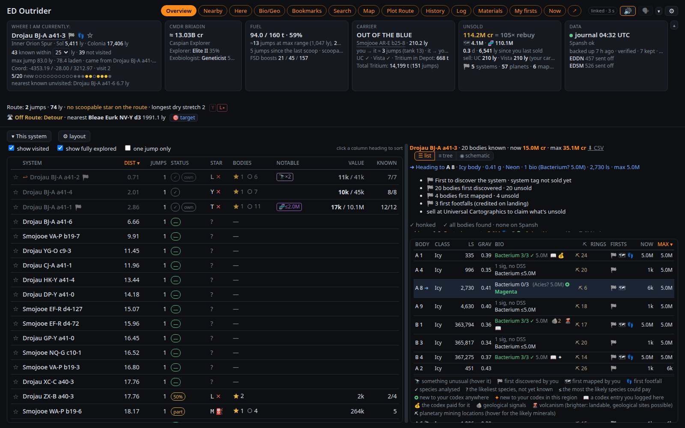
</p>

## ✨ At a glance

| | |
|---|---|
| 🔭 **Find the undiscovered** | Every known system within 25 ly is listed. If the galaxy map shows one that *isn't* on the page, nobody with an uploader has been there. |
| 🔊 **Hear it before you jump** | Target a system and get a fanfare if it's a brand-new discovery, a cheerful note if it's known but unscanned, a thud if it's been done. |
| 🪐 **See the whole system** | Every body: value, gravity, atmosphere, rings and hotspots, curiosities, and which exobiology species it could hold — before you probe or land. |
| ⚠️ **Don't leave money behind** | Target onward with mapping or exobiology worth your while still undone and the page says so, out loud if you like. Ordinary systems stay quiet. |
| 💰 **Know what's on board** | Unsold cartographics and exobiology in credits, bonuses included, and your unsold 🏁 first discoveries. Dock somewhere that buys it and it tells you to sell. |
| 🌿 **On the ground** | What is left to sample on the body, a countdown to the next colony, and a warning when a run elsewhere would be discarded. |
| ⛽ **Fuel you can trust** | Jumps left at max range and at your pace, laden range, fuel per hop, how scoopable your recent stars have been, and a nudge to top up before a dry stretch. |
| 🧭 **Decide where to go** | Unfinished systems nearby, the nearest buyers for your data, bookmarks and a next stop, stellar phenomena, and a search across Spansh. |
| 🛣 **Neutron Highway** | Plot a neutron route with Spansh for any ship you have flown; Outrider follows it as you fly and says the next stop. |
| 💰 **Road to Riches** | Plot a [Spansh Road to Riches](https://spansh.co.uk/riches) route in the Riches tab; Outrider follows it as you fly, shows what is left to scan and map in each system from your journal, and says it on arrival. |
| 📜 **Your logbook** | Every journal event in a searchable log, every exobiology sample and what became of it, and a schematic of the system. |
| 📈 **The long view** | Each trip from sale to sale with what it actually paid, what each ship loss cost, your best finds, ranks and career statistics. |
| 🗣 **A voice with personality** | A natural neural voice, down to business, sarcastic or sweet, briefing you on arrival and warning before you leave something unfinished. |
| ⛏️ **Rhino mining** | A heading-up surface map on Now with your rigs, sample points and ship, and every collection kept per body. |
| 📱 **A tablet in the cockpit** | Every page in a touch layout with nine themes, alerts as banners, game buttons on a control rail, and the voice on the tablet if you like. |
| 🎙️ **Ask out loud** | "Hey Vespa, status report": answered in the voice from what Outrider knows, with an optional AI for anything else. |
| 🎯 **Automation (game PC; Linux, Windows experimental)** | Auto honk fires the Discovery Scanner on arrival, auto-target targets the next Highway system, and one HOTAS button asks for a status report. |

## 🚀 Getting started

```bash
./launch_outrider.sh   # Python 3.11 or newer
```

Open **<http://127.0.0.1:8025/>** and go fly.

`launch_outrider.sh` sets Outrider up the first time (a virtual environment in `.venv` with `requirements.txt`),
installs again only when `requirements.txt` has changed (after a `git pull`), and otherwise starts Outrider at once;
its arguments go to Outrider (`./launch_outrider.sh --port 8026`). By hand it is
`python3 -m venv .venv && .venv/bin/pip install -r requirements.txt`, then `.venv/bin/python ed_outrider.py`.

**On Windows**, install [Python](https://www.python.org/downloads/) 3.11 or newer and double-click
**`launch_outrider.bat`** (or run it in a Command Prompt): it does the same. Everything works there; auto honk, auto-target and the control rail
are **experimental on Windows** (they press keys the Windows way, untested against the game so far), and the
co-pilot button is Linux only for now. Windows is less tested than Linux: if something goes wrong, an issue on GitHub
is welcome.

> [!TIP]
> The first start reads all your journals (a few seconds); after that it only reads what's new.
> Journal folders are found automatically on Windows and Steam/Proton. A browser needs one click on the
> page before it plays sound: the red **Click Here To Allow Audio** pill asks for it.

`requirements.txt` also installs two optional parts; leave either line out if you don't want it:

- **Piper** (`piper-tts`, about 100 MB) for a natural speaking voice.
- **evdev** (Linux only) for auto honk, auto-target, the control rail and the co-pilot button (Windows needs
  nothing extra for the first three). It is built from
  source, so it needs your distribution's Python development headers.

Not from pip, and optional too: on Linux the Highway's clipboard copy (and auto-target's paste) need **`wl-copy`**
(the `wl-clipboard` package, for Wayland) or **`xclip`** (for X11), from your distribution, e.g.
`sudo apt install wl-clipboard` or `sudo apt install xclip`. Without either, nothing is copied and everything else works
(the start-up log says which one it found). Windows needs nothing.

Start Outrider with the `.venv`'s Python (`.venv/bin/python ed_outrider.py`, as above): plain `python3 ed_outrider.py` finds Piper and evdev in a `.venv` in the Outrider folder, but aiohttp must then be installed for that `python3` too.
Your own files (the database, backups, downloaded voices, banned lines) all go in `data/`.

Run this way, on the PC the game runs on, everything works. Further down: [opening the page from a tablet or
another device](#-other-devices-on-your-network), [running Outrider as a server in Docker](#-running-as-a-server-docker)
(the automation is off there), and [asking an AI client about your game](#-ask-an-ai-about-your-game).

## 🖥️ The views

<table>
<tr>
<td width="50%" valign="top">
<b>Nearby</b> — every known system within range (20–50 ly, the Where tile's dropdown): distance, how much
is scanned, the main star and whether it scoops, notable bodies, curiosities (🔭) and a credit estimate. Sort,
or hide visited and fully scanned systems. A dashed <i>old data</i> mark flags Spansh records from before
Odyssey (thin-atmosphere planets there may hold unsampled life). ⛏ N counts planetary mining locations on
ground worth a Rhino.
<br><br>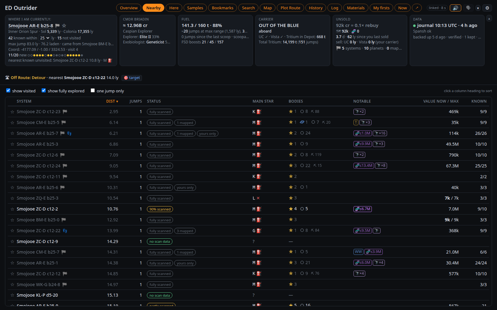
</td>
<td width="50%" valign="top">
<b>Here</b> — the current system body by body: values, bio and geo signals, 🌋 volcanism, and before the
DSS the genera each bio signal could be. Hover a body for a summary, click it for everything, with a picture of
it drawn from its scan data (an impression: class colours, bands, clouds, atmosphere, rings, size). ⛏ gives a
community survey's mineral odds for that ground (odds, not contents) and what your SRV mined there before.
The to-do line ticks itself off as you honk, map and sample, in a suggested order with supercruise time and
credits per minute ("~2 min · 450k/min"; "skip?" when not worth the trip). Bio nobody has set foot on is
valued with the ×5 first-footfall bonus.
<br><br>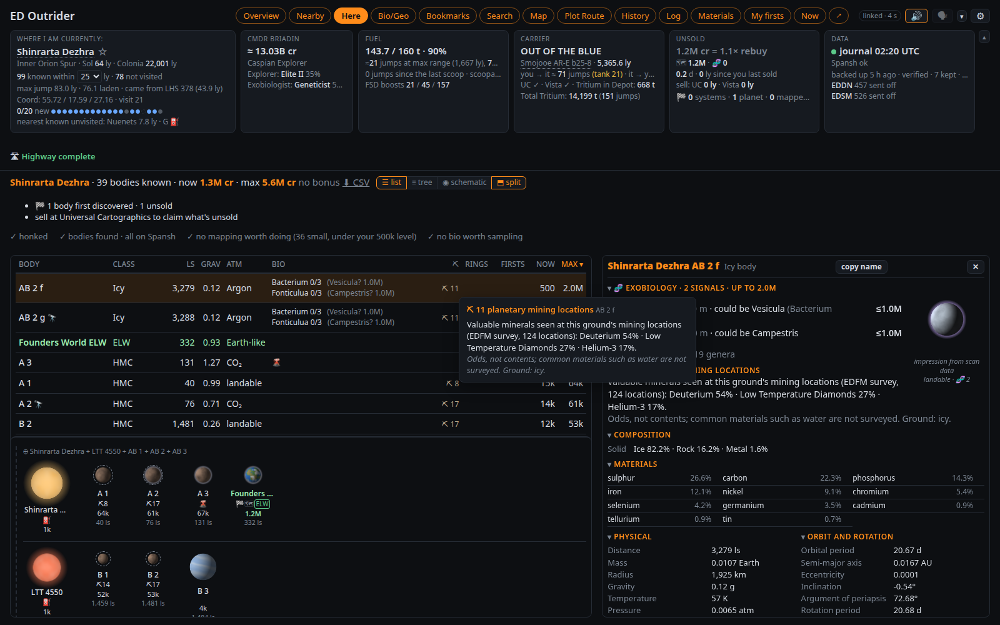
</td>
</tr>
<tr>
<td width="50%" valign="top">
<b>Map</b> — a 3D view: left-drag to rotate, right-drag to move, scroll to zoom. Your path in orange,
your first discoveries in gold, visited systems in blue (by touch: one finger rotates, two move, pinch zooms); tick <i>boost stars</i> for neutron stars and
white dwarfs.
<br><br>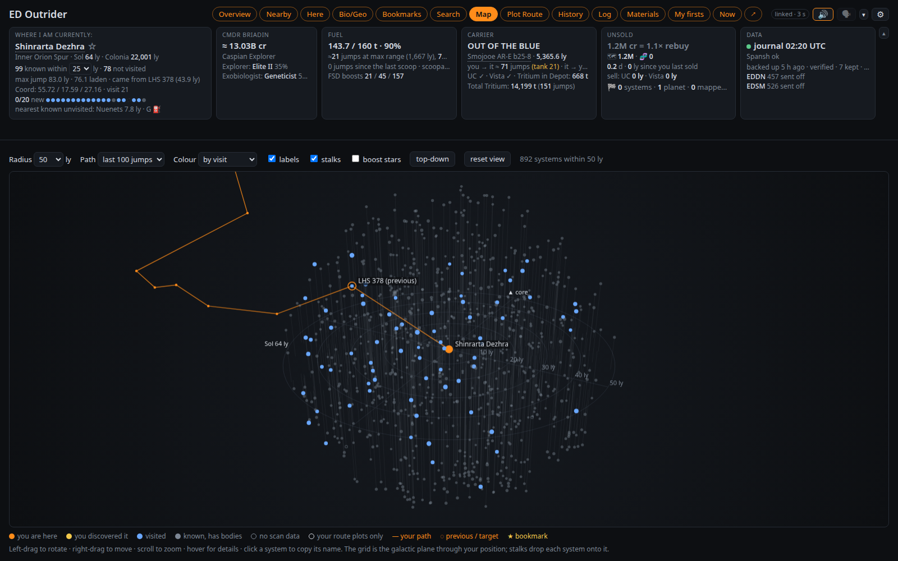
</td>
<td width="50%" valign="top">
<b>History</b> — sessions (jumps, light-years, discoveries, mapping, samples), an all-time row, "since
your last sale" and the game's career statistics. Below: every trip from sale to sale with what it paid
against Outrider's estimate, the exobiology ×5 checked against the prediction, credits per hour and per jump,
what each death cost, and your 25 most valuable finds.
<br><br>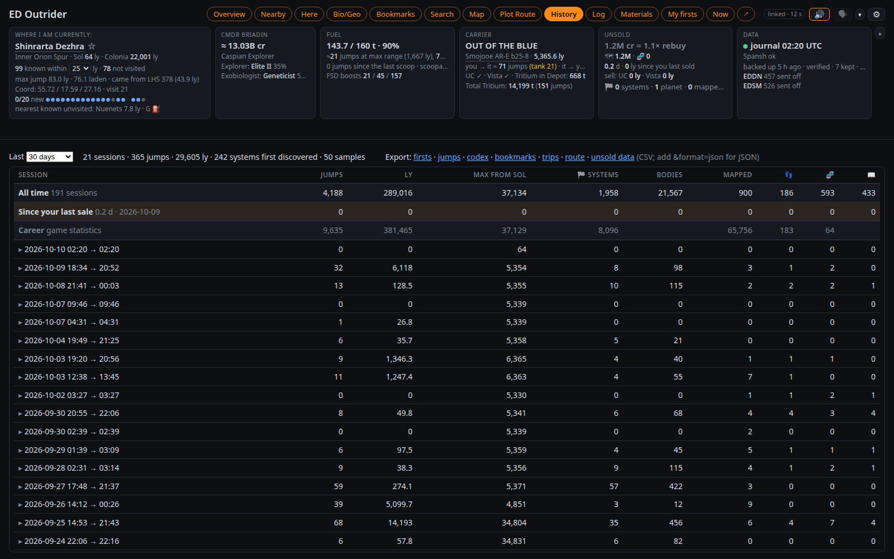
</td>
</tr>
<tr>
<td width="50%" valign="top">
<b>Samples</b> — every exobiology sample run: species, variant, body, value, and whether it is
<i>aboard</i>, <i>sold</i> or <i>lost</i>. Filter, sort, export; codex entries underneath. Unsold runs are
priced one by one ("x5 on 42 of 47 runs").
<br><br>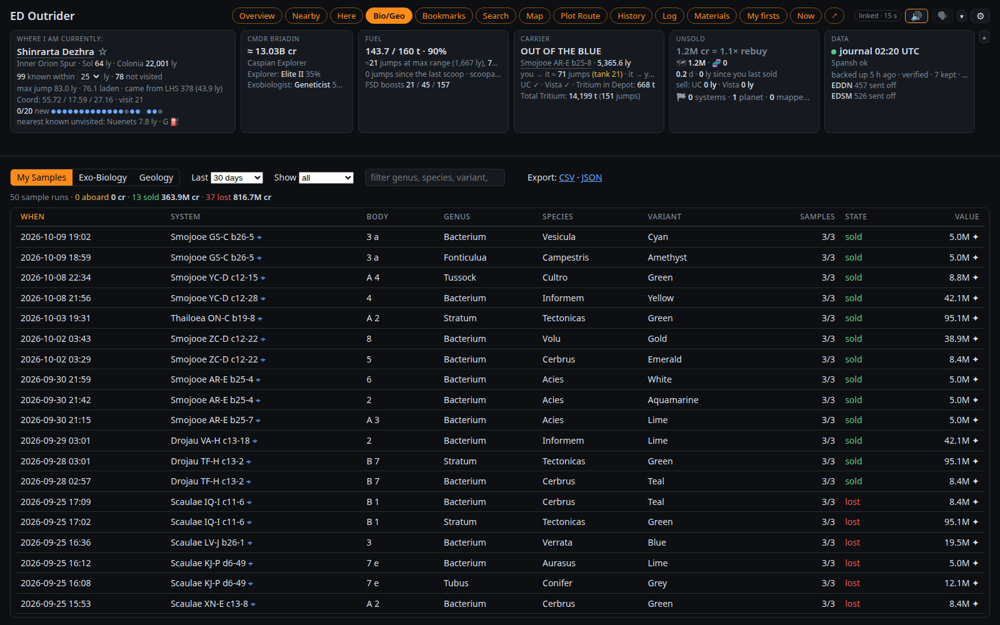
</td>
<td width="50%" valign="top">
<b>Log</b> — every journal event, newest first, one readable line each. Filter by category and time,
search any text, click a row for the raw event.
<br><br>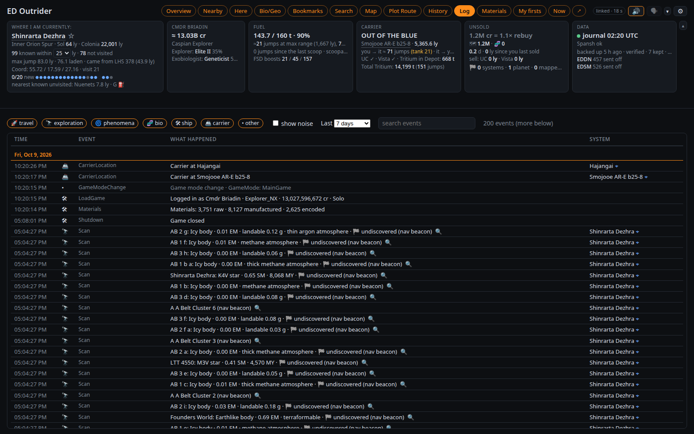
</td>
</tr>
<tr>
<td width="50%" valign="top">
<b>Materials</b> — materials against their caps, and how many FSD injections, limpets, SRV refuels and
repairs and Rhino rig restocks you can make now. <b>Mining sites</b> lists each body your SRV mined: minerals
and tons, saved spots, the last date and the distance.
<br><br>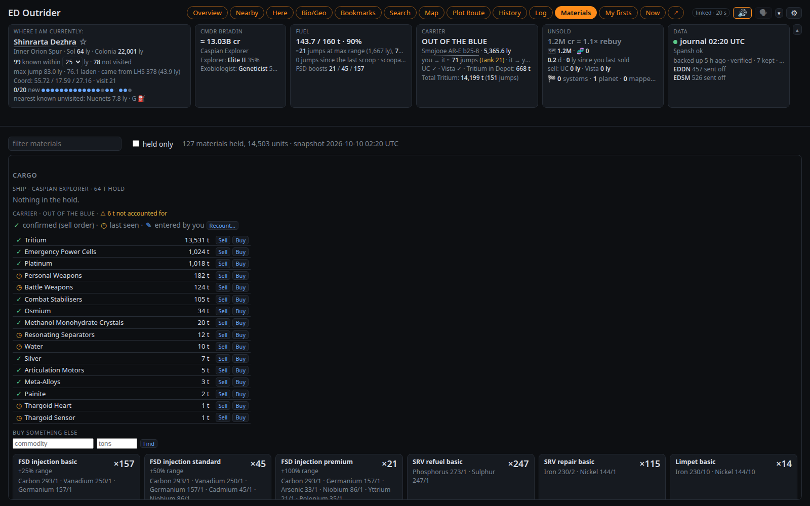
</td>
<td width="50%" valign="top">
<b>Schematic</b> — Here switches between <i>list</i>, <i>tree</i> (orbital order) and <i>schematic</i>: stars
with their planets left to right, moons underneath, barycentres boxed, each scanned body drawn from its scan data (as
in the body panel: class colours, bands, oceans, clouds, atmosphere, rings). <i>Split</i> (on by default)
keeps the schematic under the list or tree.
<br><br>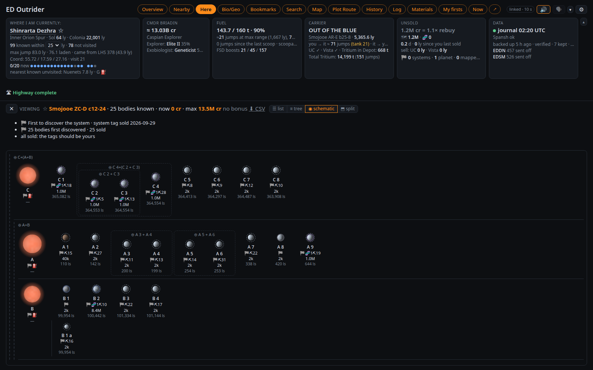
</td>
</tr>
<tr>
<td width="50%" valign="top">
<b>Search</b> — systems with particular stars (or just <i>scoopable</i>), planets, rings, hotspots,
unfinished exobiology or planetary mining locations (one mineral, if you like) within a radius, from what
Outrider knows (<i>Local</i>) or everything reported (<i>Spansh</i>). The name box finds any system and opens
it in Here, where ☆ bookmarks it or makes it the next stop.
<br><br>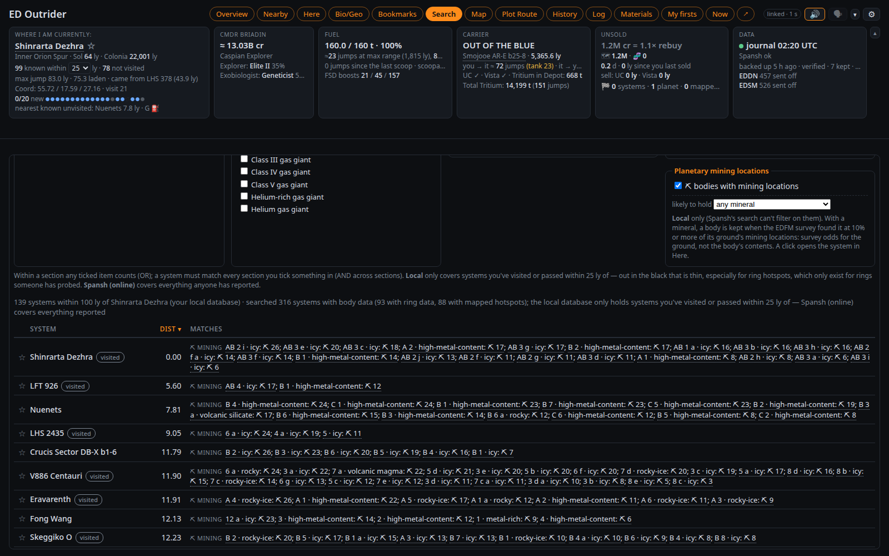
</td>
<td width="50%" valign="top">
<b>My firsts</b> — visited systems with first-discovery data you haven't sold. The <b>firsts watch</b>
checks them on Spansh in the background and marks any someone else has scanned since you ("👁 8 d after you");
selling first still keeps your name if nobody sold before you. <b>Show lost</b> with <b>within N ly</b> is a
rescan checklist for data lost with a ship, nearest first, priced by what is left to scan and map. <b>Left
behind</b> lists nearby systems with work over your thresholds; <b>Bookmarks</b> hold notes and your <b>next
stop</b>.
<br><br>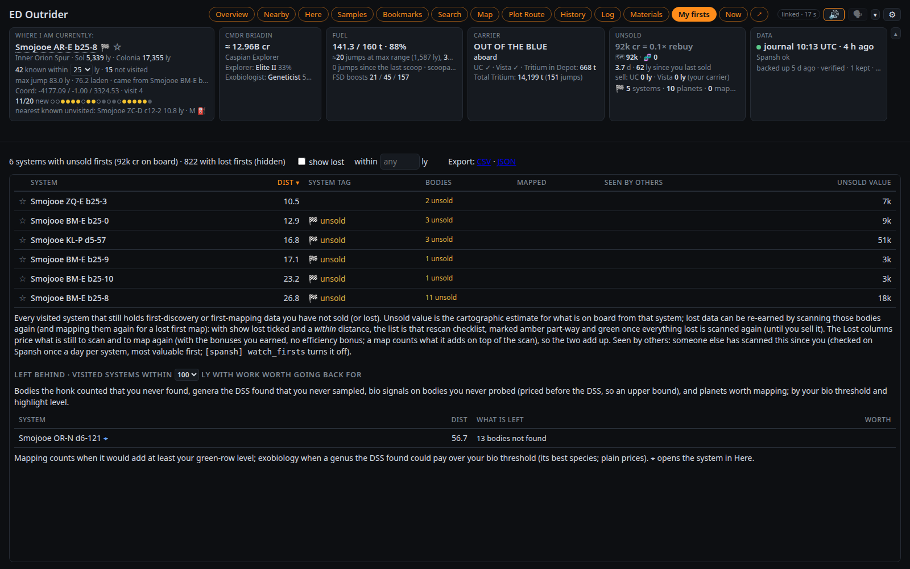
</td>
</tr>
</table>

The **Overview** at the top shows Here and Nearby together: drag the divider, swap sides or stack them.

On a window of at least about 900 × 600 the page fits the window: the header stays put and each list scrolls
in its own box. **▴** folds the tiles into one line (remembered on this device; Settings → Display can fold
them only on a small window). A table too wide for its box
switches to short forms ("HMC", "G star"; hover for the full text) rather than scroll sideways.

**Themes.** ⚙ Settings → Display → **Theme on this browser** dresses the page in one of the tablet's themes: LCARS,
Elite, Babylon 5 (Earthforce, Narn, Minbari, Centauri), Sith, Rebel Alliance or Dark, each with its colours, its
lettering on the title, tabs and labels, and its shapes. **Default - Outrider** is the look above, and the only one that
follows your system's light mode. Each browser keeps its own choice, and the tablet has its own.

<p align="center">
  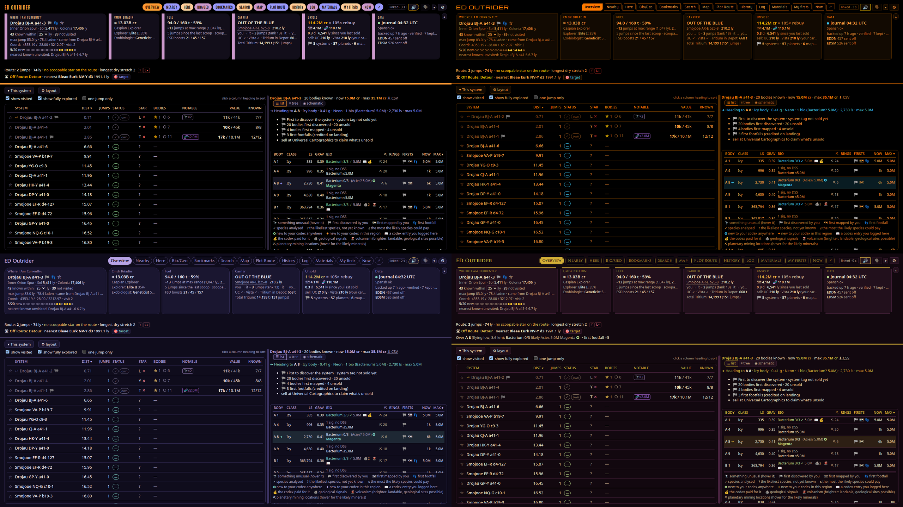
</p>

**Now** is the cockpit view for a second monitor or a tablet, in big text: the system, the target, fuel,
what to do next, the body you have targeted, and the nearest unvisited system.

- An **at-risk line** shows what is aboard against your rebuy ("🗺 380M · 🧬 412M aboard · 3.2× rebuy").
- **This session** since your login: "2 h 14 · 74 jumps · 612 ly · 6 new systems · 11 mapped · 4 samples ·
  ~38.0M found" (the unsold estimate's change plus what you sold). After you quit, the last session.
- **Captions** show the last three lines said; tap one to hear it again. A corner bar has 🗣, hush 30 min,
  status report and ✕ back.
- **↗** beside the Now button opens Now in its own window, or open `http://127.0.0.1:8025/?mode=now`,
  which stays on Now even after a stray click or a reload.
- It keeps the screen awake on localhost or HTTPS. On a tablet over plain http, set its screen timeout.
- On a planet, the **surface map** appears under the lines (see below).

The **header** shows the galactic region, ranks, fuel, hull, any core module under your level (`module_warn`,
80%; as of the last Loadout or repair, since the journal logs nothing in between), your carrier's jump countdown,
the nearest places to sell, and the last backup.

The **fuel tile** counts jumps as the ship gets lighter ("≈6 jumps at max range (484 ly), 3,500 at your pace"),
for any drive, engineered or not, from your own Loadout and jumps. Nearby shows laden range and the targeted
jump's cost ("38.2 ly · 0.9 t · leaves 5 max jumps"). "scoopable: 9 of last 20" turns amber when your fuel is
short for the gaps between scoopable stars. In the SRV or the Nomad it keeps the ship's tank and adds the
vehicle's own fuel.

Under the Where tile, the **discovery streak** is a dot per arrival for your last 20 (gold: first discovery,
amber: bodies nobody had reported, blue: known, grey: revisited), and the **unreported horizon**: "nearest
known unvisited: Xyz 4.8 ly". Any unvisited star closer than that on the galaxy map is one nobody has reported.

## 🔔 Alerts

Alerts fire only for something out of the ordinary. Each can play a sound (🔊), show a desktop
notification and be spoken (🗣), chosen per alert in **⚙ Settings → Alerts**:

- a new discovery targeted, or arriving somewhere nobody has been
- leaving with mapping or bio over your levels undone, or a first-discovered Earth-like, water, ammonia or
  terraformable world unmapped
- a valuable body the moment the FSS resolves it, and a new codex entry
- low fuel where you cannot scoop, and a top-up worth taking before a dry stretch
- docking where the station buys your data, and what you banked when you sold
- a sale that left data aboard (Universal Cartographics sells 50 systems a page; at Vista Genomics, the species
  you kept back), said 90 seconds after the last page
- hull damage, heat damage, interdiction, and unsold data past a threshold
- your carrier arriving somewhere new or leaving without you
- a Rhino mining rig nearing the 5 km leash, and rigs still marked out when you dock the Rhino (see The surface map)

Spoken but not notified unless you tick it: the arrival briefing, the FSS debrief, leaving a body with
sampling unfinished, each species completed, tank full, a high-gravity approach with a lot aboard, the
Neutron Highway's next stop, auto-target's result, the jump line, auto honk's result, and discovery streaks (ten known systems in a row, or five undiscovered). Off
until ticked: **jumponium** (see the voice, below).

The same dialog holds the thresholds. Your browser remembers them; the config file sets what a new
browser starts with.

| Setting | Default | What it does |
|---|---|---|
| Exobiology | 10M | A body only counts as unfinished bio if one body could pay over this. |
| Unsold data | 50M / 250M | When the header turns amber and red, or as a multiple of your rebuy. |
| Body highlights | 500k / 10M | Here's row turns green (scan + map) or its bio violet (species) over these. Bonuses left out. |
| Approach warning | 2 g | Gravity at which orbital cruise at a landable body warns you, with data over the amber level. |
| Max with bonuses | on | Whether Here's Max column counts first-discovery, mapping and footfall bonuses. |
| Discovery streak | 10 / 5 | Known or undiscovered systems in a row for a spoken line (0 turns it off). |
| Suggested order | 100k/min | Supercruise credits per minute under which Here marks "skip?". |
| Fuel alerts under N jumps | off | Warns once when jumps left at your pace fall under N; also sets the top-up level. |
| Core modules | 80% | A core module under this shows under hull and is said in the status report. |
| Surface map | 1,000 m / 500 m / 50 m / 3,500 m | Altitude it shows below, narrowest view, rig spacing ring (0 = none), rig leash warning. |

**Export settings** and **Import settings** move them to another browser profile. **Use these for new
browsers** keeps a copy on the server (`data/browser_defaults.json`, included in backups), so a tablet running
Now starts with your voice, names and alert choices. The view and layouts stay per device.

Targeting a system plays its sound; arriving is announced by the voice. Walking about a station counts
as docked. A carrier jump booked just before you quit shows as "not yet confirmed" until your next login.

## 🗣 The voice

Alerts are spoken when 🗣 in the header is on. **Piper**, a neural voice running on your CPU, sounds far
better than the browser's own voice. The voice is Cori (`en_GB-cori-medium`) unless you pick another, and it
downloads into `data/piper-voices/` the first time. ⚙ Settings → Voice switches between installed voices, and its
**More voices** lists every Piper voice by language: pick one and Outrider downloads it and switches to it (on a
Docker server too).

Without Piper installed, the browser's own voice speaks. With Piper, the browser's voice is never used: a line Piper
can't say is not said (what you asked for is still shown as a caption).

**"Click Here To Allow Audio".** A browser plays no sound on a page until you click on it, and Outrider reloads the
page itself after an update. When the window that speaks is held back like this, a red **🔇 Click Here To Allow
Audio** pill appears on the menu bar (and 🔇 in the tab's title), the tablet's caption line says the PC's page needs a
click, and the lines wait: they play once you click, or are dropped if they are no longer news. "Play speech and
sounds on this PC" needs no click. To never be asked, allow sound for the page in the browser (Chrome: Site settings →
Sound: Allow; Firefox: Autoplay: Allow Audio and Video).

**Choosing how it sounds**

- **Personalities.** Down to business, sarcastic and sweet, fifty lines per alert each; tick any mix.
  **With profanity** adds swearing versions. **One personality per system** holds one character a system.
- **Danger alerts always down to business** (on by default): danger is said plainly, never sworn.
- **Your names.** Commander names are often unpronounceable, so the voice calls you by the names in
  **Call me** (default "Boss, Hefay, Sir").
- **Speed.** 1× is the voice's own pace. Some Piper voices respond to it less than others.
- **Your own lines.** Edit `resources/speech.json` (or a copy named by `speech_file`) to change lines or add a personality; no restart needed.
- **A voice per personality.** In `speech.json`, a personality can name its own installed Piper voice and
  speed: `"sarcastic": {"label": "Sarcastic", "voice": "en_US-ryan-high", "speed": 1.1}`. Each extra voice
  takes 60–100 MB of memory.

**What it says**

- **Arrival briefing.** One sentence after the honk: "Known. 12 bodies. Scoopable M star. The Earth-like
  world at A 2 is unmapped, 1.4 million." Entering a new galactic region opens it ("Entering the Norma Arm.").
- **Routine systems: sound only** (a tick, off by default) plays a soft two-note sound instead of the
  briefing where there is nothing to do.
- **FSS debrief:** what is worth doing once every body is found. **Signals** as the FSS finds them.
  **The jump line** in the hyperspace tunnel, with whether the star ahead is scoopable, and any hazard.
- **Greeting and goodbye:** what is at stake after a long break (and any core module under your level), and a
  session recap when you quit.
- **Exobiology:** leaving a body mid-run warns; the third sample says what it paid and what is left.
- **Approach:** "2.6 g. 480 million aboard, 3.2 rebuys. Land gently."
- **Fuel:** low fuel where you can't scoop, and the **top-up warning** before a likely dry stretch.
- **Jumponium** (off by default): the best landable body with a material your FSD injections are short
  of ("B 4 has polonium, 1.3 percent.").
- **Mapped** (off by default: **Say when a planet is mapped**, or `speak_mapped`): after each DSS mapping,
  "A 2 mapped efficiently, 3.4 million. Next: biology on C 2, up to 19 million." It says so when you went
  over the probe target, and "Nothing else here over your levels" when the system is done. A map to do next gives
  the body's value without and with your bonuses: "Next: map 7, 771 thousand, 2.2 million with bonuses".
- **Ship-loss debrief:** what went down with the ship and the nearest lost system to go back to.
- **System names said properly:** "Drojau LL-O b26-3" is said "Drojau L L O, b 26 3".

**How it behaves**

- **Most urgent first.** Danger jumps the queue. Lines that waited over 20 seconds, or are about a system
  you've left, are dropped. Charging the frame shift drive clears the queue.
- **No repeats too soon.** Each alert goes through every line in your personalities before any comes round
  again. The browser remembers what you have heard across reloads.
- **Hush.** The **▾** beside 🗣 hushes for 10 minutes, 30 minutes or until the next jump. Danger and anything
  you ask for still speak. The hush is kept by Outrider, so a hush from a tablet or the co-pilot button
  quiets the PC too.
- **One window speaks.** With the page open in several windows, only one speaks and plays sounds, so nothing
  is said twice. **Speak from this window** takes over; **This screen speaks: auto / always / never** sets it
  per browser. A tablet with **Play alerts here** speaks as well, whatever the PC does (see On a tablet).
- **Play speech and sounds on this PC.** Ticked in the dialog, the PC running Outrider plays the voice and
  sounds itself: no click to allow audio, and the voice comes from the PC even with the page on a tablet (a page
  must still be open). Linux only: `pw-play`, `paplay`, `aplay` or `ffplay` (`[speech] server_player`). Not in
  Docker: a server has no speakers to play on.
- **Volume** (in the dialog, per device) sets Outrider's own voice and sounds, in the browser or on the PC.
- **Your own sounds:** `[speech] sound_dir` names a folder of `<name>.wav` files (fanfare, thud, chime, alert… the
  names in `static/sounds.json`), up to 3 seconds each; each replaces that sound in the browser and on the PC. The
  dialog lists the ones it uses and why any file is not used.
- **The jump line** ("Jumping to Hwy Stop 38") is said once you are in the hyperspace tunnel, not over the game's
  own countdown call; it has its own varied lines in `speech.json` (`fsd_charge`). The scoop and hazard warnings
  are said after it.
- **The last line said** shows beside the header's icons, with ▶ to hear it again.
- **Lost contact.** If Outrider stops answering for 30 seconds, the speaking window says "Lost contact with
  Outrider. No alerts until it is back." in your Piper voice (made in advance while the link was up; without Piper,
  the alert sound), and "Back in contact" when it returns.

**Spoken lines: what was said, and banning lines**

Open ⚙ Settings and its **Spoken lines** section (the last one). It lists this
window's last 100 alerts and what became of each: said, cut short, dropped or silent, and why. **copy**
puts it on the clipboard.

- Above the list, **This session** counts each alert's lines, noisiest first ("Arrival brief 42 · FSD charge
  40 (3 dropped)"). **🔇** beside one stops speaking that alert (its 🗣 tick), with an undo.
- Press **👎** beside a line to never hear that wording again, in any browser or in the voice lab.
- "3 lines banned · review / undo" above the list lets you take a ban back.
- Bans live in `data/speech_banned.json` (beside your own copy when `speech_file` names one), so editing
  `speech.json` never loses them.
- The last line of a list can't be banned, so no alert ever goes quiet.

**The voice lab.** `python3 voice_lab.py` opens a small window for trying voices before you settle on one.
Play a random line from any alert and personality, or type your own; Save WAV keeps it. **✂ Cut this line**
bans it, like 👎. **▶ Audition** plays eight key alerts in a row. The lower half lists every Piper voice on
Hugging Face: double-click one to download it for Outrider too.

## 🗺️ The surface map

On a planet, Now shows a map under its lines: on the ground, in the SRV, on foot, or flying below 1,000 m
(it hides again 100 m higher). Hiding deletes nothing.

<p align="center">
  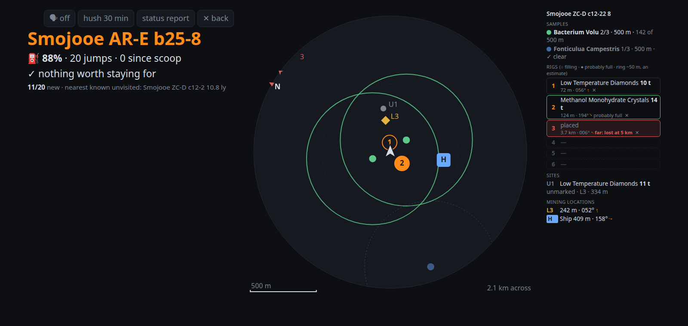
</p>

- **Heading-up:** the way you face is the top, you are the arrow in the middle, N on the rim is north. It
  zooms to fit everything within 3 km, never narrower than 500 m, with a scale bar.
- **What is drawn:** your ship (a landing-pad H), the samples of unfinished bio runs with each species' colony ring (the
  current run solid), your rigs 1–6 with a faint spacing ring, saved sites (U1… unmarked, S1… rigs picked
  up) and mining locations (L3). Anything off the map is a chevron on the rim.
- **The legend** names each tag, nearest first. Six rig slots mirror the game's HUD: mineral (or
  "placed"), tons so far, distance and bearing. A solid rig is **probably full**: 8 minutes since it was
  placed or last collected from.
- **The leash:** the game destroys a rig 5 km from its Rhino. Past 3.5 km it turns red and the voice warns,
  again at 4.5 km ("Rig 3 is 3.8 kilometres away, behind you; it is lost at 5.": which way, in eight sectors).
- **Strip copy:** a tick in the dialog adds a small copy to the on-body strip, with a one-line legend.

**Marking rigs.** The game logs nothing when you deploy or pick up a rig, so you tell Outrider with the
co-pilot button. In the Rhino on a planet:

- **Tap away from your rigs:** the next rig (lowest free number, 1–6) is placed 7 m behind you, where the
  game drops it. "Rig 3 placed."
- **Tap within 5 m of a rig:** it is picked up and its number is free again.
- The button does nothing else in the Rhino. Anywhere else it works as usual. Getting out on foot and back in
  keeps it marking rigs.
- **Forgot to tap?** The ✕ by a rig's slot in the legend marks it picked up.
- **Rigs still out:** docking the Rhino with rigs still marked out on the body says so, and a card shows it
  ("Rigs 2 and 5 still marked out; rig 5 is probably full."). It is Outrider's record, not the game's, so a
  rig picked up without a tap counts until you ✕ it.

**Automatic:** collections (the tons go to the rig under you, or an unmarked site, and are said once you
stop: "Rig 3: 12 tons of Water."), your ship's landing spot, mining locations you targeted from the ship, and
rigs lost at 5 km, on leaving the body, or with the Rhino destroyed, a death or a relog. **Not automatic:**
placing and picking up rigs, and what a deposit holds. A rig that collected anything is kept as a saved site
for your next visit and listed under Materials' **Mining sites**.

The map's sizes and the leash distance are in the thresholds table under Alerts; the spoken leash warning
always uses the config file's `rig_warn`.

## 💰 Road to Riches

The **Riches** tab plots a [Spansh Road to Riches](https://spansh.co.uk/riches) route: a chain of systems whose planets
are worth scanning (and mapping). Give it a start (default: where you are), a range (default: your ship's), and
Spansh's own options (radius, number of systems, minimum value, maximum distance, mapping value). Outrider follows the
route as you jump, marks every body you have scanned or mapped (read from your journal), says on arrival how many
bodies are worth the stop and the next system, and copies the next system's name to the clipboard like the Highway
does. The route is kept until you clear it or plot another. Spansh publishes no description of this API:
`scripts/riches_probe.py` checks it against the live site.

## 🛣 The Neutron Highway

The **Highway** tab plots a route with [Spansh](https://spansh.co.uk), using neutron stars as boosts, and
follows it as you fly. One route is kept (following it needs no network) until you plot another or
**Clear route**.

<p align="center">
  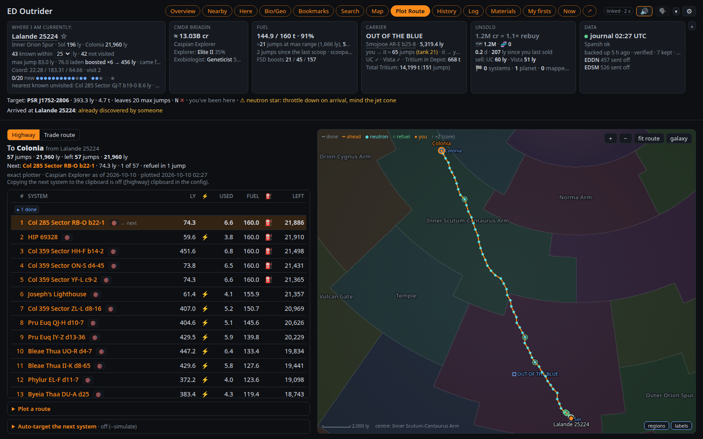
</p>

- **Two plotters.** **Exact** (the default) plans every jump with its fuel and refuel stops from your ship's own
  figures (drive, masses, tanks, Guardian booster, engineering) and your cargo. **Neutron** plans waypoints only,
  from a range, the supercharge (×4, or ×6 with the SCO Mk II) and an efficiency: for a ship you haven't flown, or
  a quick plot.
- **Ship.** Any ship you have flown, as of its latest Loadout. The neutron plotter's **Range** starts at that
  ship's laden range; type another to override it.
- **Conservative range** (off by default): jumps a margin (5 ly) shorter than the ship's range, leaving room for a
  fuller tank.
- **Too much fuel.** A long neutron jump may be in range only with the fuel the plotter expected. On arrival, and
  as you scoop, Outrider checks the next jump against the fuel aboard and warns ("⚠ too much fuel for the next
  jump: ≤ 36 t, you have 140 t").
- **The list** shows the next 200 jumps with distance, ⚡ neutron, fuel and ⛽ refuel stops (the exact plotter's: the
  neutron plotter has none, scoop as you go); click a name to copy
  it. The map beside it draws the route on the galactic regions with landmarks and your carrier. You can put your
  own galaxy image under it (`background_image`, an EDAstro chart say).
- **Following.** Arriving at any route system moves you along, forwards or back; anywhere else (a respawn
  included) is **Off Route: Detour** until you are back on it, with the closest route system marked. A line under
  the tiles shows the next stop ("🛣 Next: Hwy Stop 38 · ⚡ neutron · 4.2 ly · 38 of 399 · refuel in 3 jumps").
- **Clipboard.** On arrival the next system's name goes on the desktop clipboard for the galaxy map (Linux:
  `wl-copy` or `xclip`, see Getting started; Windows: built in; on the game PC only).
- **The voice:** "Next Neutron Highway Stop: Hwy Stop 38, with three jumps left to refuel. Boost your FSD to
  continue.", plus refuel stops, detours, "Back on the highway", "Highway complete" and the fuel warning.

**Auto-target** (Linux, Windows experimental; on the game PC only, off by default; the tab's **Auto-target the next system** box). After an FSD supercharge
in a route system it waits 5 s, then presses keys to make the next route system your target: it opens the galaxy
map, searches for the system, plots the route, closes the map and checks the target took. It says "Successfully
targeted neutron jump target Hwy Stop 38" (or "Failed to…") under its own alerts row.

- **Keyboard bindings:** Galaxy Map Open, UI Up, UI Select and the galaxy map's Camera Yaw Right and Camera Zoom
  Out need one (the box lists any missing; a built-in preset can't be read). It shares auto honk's virtual keyboard;
  honk goes first.
- Switching it off, clearing the route or plotting a new one stops a run at once, even mid-way. If the game targets
  a different system it says so by name ("Targeted the wrong system: …. Check before you jump."). A waypoint the
  game reaches by a plotted route of several jumps counts as targeted.
- It never runs docked, landed, in a vehicle or on foot, in danger, with the FSD charging or a panel open. It stops
  if anything unexpected happens, closing the map only if it opened it.
- **The keys go to whichever window has focus**: stay in the game until it is done.
- The log gets one line per run ("highway auto-target: targeted Hwy Stop 38"); every step is printed only when it
  fails.
- **🎯 Target next** (in the box, and beside "Next:" in the route line on Overview, Nearby and Here) does the same
  on demand, whether or not auto-target is on: the next route system, or off the route the closest one, after a
  5-second countdown to click back into the game. A failed run puts **⟳ Retry** on its route row.
- **Test now** in the box targets the nearest known system a plain jump away, after a 5-second countdown.
  `python3 -m outrider.target --show` prints the steps with your keys.
- Every step can be changed under `[highway]` (`autotarget_search`, `autotarget_submit`, `autotarget_plot`…) if a
  game update moves things; `autotarget_entry = "paste"` pastes the name instead of typing it. Pasting (also how
  it enters a name a US keyboard layout can't type) needs the clipboard: `wl-copy` or `xclip` on Linux.
- **Frontier's rules:** this is key-press automation like auto honk (and tools such as Auto_Neutron). Whether to
  use it is your call.

## 🎯 Auto honk

Outrider can fire the Discovery Scanner for you, on Linux (and on Windows as an experiment). It runs on the game PC
only (never in Docker). On arriving by hyperspace it waits a moment,
holds Primary Fire, and says how it went ("System Scan Completed, 12 Bodies discovered"). It is off until
you tick it in ⚙ Settings.

- It waits while a map or panel is open, and while the HUD is in combat mode (switch to analysis mode).
- It learns which fire groups the scanner is in, per ship, and waits on a group where it has missed twice in a
  row (one miss can be an alt-tab, which sends the key to another window).
  The dialog's **forget** clears that after you move the scanner.
- It skips systems you've already honked, Apex shuttles and multicrew.

Setting it up:

- **The Discovery Scanner must be on primary fire** in the fire group active when you jump.
- **Primary Fire needs a keyboard binding** in Elite's controls (as its second binding, if your trigger is
  the first). Outrider reads it from your active controls preset, modifiers too. A built-in preset can't be
  read: save it as a custom preset, or set `[autohonk] key`. A binding that needs a joystick modifier can't
  be pressed.
- **Try it first.** The dialog's *test in 5 s* button, or `python3 -m outrider.honk --test 10`, holds Primary Fire
  once. `python3 -m outrider.honk --show` prints the binding it will press.
- It presses keys through a virtual keyboard (`evdev`; Steam's controller rule already gives you access), on
  Windows with `SendInput` as VoiceAttack does, and **the keys go to whichever window has focus**, so switch it off
  before alt-tabbing away mid-jump.
- **On Windows (experimental):** don't run Elite as administrator, or Windows silently drops the keys (unless
  Outrider runs as administrator too). It has not been tried against the game on Windows yet: start with the
  test button, and an issue on GitHub saying how it went is very welcome.

## 🕹️ The co-pilot button

On Linux, one button on your HOTAS (or a spare key) talks to the voice. It needs Outrider on the game PC (never in
Docker), where the HOTAS is plugged in:

- **Tap:** a status report: fuel and jumps (and any core module under your level), on a Highway route the boost
  and the next route system, the next stop, what is aboard against your rebuy, and the nearest unvisited system
  (left out while you follow a route). With a body targeted it leads with that body
  ("A 3: 2.4 g, thin ammonia, 3 bio signals, up to 19 million, about 2 minutes, worth it"); mid-run on a body,
  the sampling. A tap mid-line cuts it short.
- **Double tap:** the last line again.
- **Hold:** hush until the next jump; hold again to end it.
- **In the Rhino** on a planet, any press marks rigs instead (see The surface map).

Set it up under `[copilot]` in `ed_outrider.toml`: `enabled = true`, the `device` (part of its name, such
as `"X-56 Rhino Throttle"`, or a `/dev/input/by-id/…` path; of several devices that match, the one that has the
button is used) and the `button`. Run
`python3 -m outrider.button --listen` to find the button's name. `hold_ms` and `double_ms` tune the gestures. The
Settings shows whether it is listening.

- **Unbind the button in Elite's controls.** Outrider only reads it, so the game would act on it too.
- **X-56 users:** avoid the latching toggles and the mode wheel. They report as buttons held down, which
  reads as one endless hold.
- **Access:** joysticks and throttles are readable by the logged-in user on most distributions (`uaccess`).
  A keyboard or mouse needs your user in the `input` group, which lets every program read your typing, so a
  joystick button is the better choice.

## 📱 On a tablet

Open `http://<your PC>:8025/tablet` on a tablet in landscape (made for a larger tablet, about 1280 × 800 CSS pixels):
the same pages in a cockpit layout, in one of nine themes: LCARS (below), Elite (the cockpit HUD's orange, with cut
corners), four from Babylon 5 (Earthforce: navy and steel; Narn: rust and ochre, wedge-cut; Minbari: indigo, lilac and
pearl, soft arches and thin double lines; Centauri: gold on royal purple, ornate notched double borders), Sith (black,
crimson, thin hard lines), Rebel Alliance (cockpit orange and sand, blue for what is chosen) or Dark (a modern app's dark mode: slate
cards, switches and line icons beside the words). Settings picks one per tablet. The Elite, Babylon 5 and Star Wars
themes show their emblem in the free space under the page list (credits at the bottom of this page). Outrider must listen on your network
for this: see [Other devices on your network](#-other-devices-on-your-network).

<p align="center">
  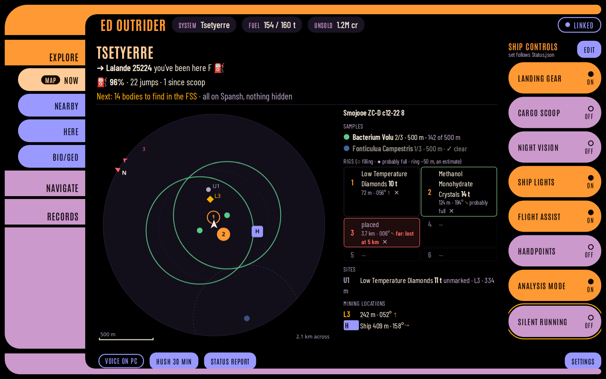
</p>

- **The strip on top** shows the system, fuel and unsold data, and the link to Outrider in words ("LINKED",
  "STALE · 48 S AGO", "NO LINK · RETRYING").
- **The pages** are on the left in three groups of four: Explore (Now, Nearby, Here, Samples), Navigate (Bookmarks,
  Search, Map, Highway) and Records (History, Log, Materials, My firsts). There is no Overview.
- **Tap a row** in a table for all of its facts, including the columns too narrow to show, with Show in Here and
  Bookmark.
- **The maps by touch:** on the galaxy map one finger rotates, two fingers move it and a pinch zooms; on the Highway
  map two fingers move and pinch.
- **On a planet** the tablet switches to Now when the surface map appears (the Now button says MAP) and back to your
  page when it goes. Nothing else switches pages by itself.
- **Alerts** are a banner across the top (red for danger), and the footer has Hush, Status report and the last line
  said.
- **The voice stays on the PC,** unless you tick **Play alerts here** in the tablet's Settings. Then the tablet speaks
  (in Piper, from Outrider) and plays the alert sounds itself, whether or not a PC browser does too: just the thing
  with a Docker server and no browser open (turn one off if you hear both). **Choose alerts…** under it picks which
  alerts the tablet says (🗣) and plays (🔊), apart from the PC's choices; it starts from what the PC saved as defaults
  for new browsers.
- **Target next** on the Highway runs at once (no countdown), since tapping the tablet leaves the game focused. Auto
  honk, auto-target's switch and test, backups and the voice settings stay on the PC.
- **Settings** (bottom right): the theme, a dim switch, the theme's emblem, **Show the game controls** (off: no rail
  on this tablet and the pages take its width, for a second tablet), Play alerts here and Choose alerts…, the screen size in CSS
  pixels, the app's version and, in the Android app, its own screens (Server…, Voice…, App menu…), and Sign out when
  Outrider asks for a password.
- **A smaller tablet** (under 1200 × 700 CSS pixels) gets a compact layout: a narrower page
  list, and a narrower rail whose eight buttons fit without scrolling, with short names (Gear, Scoop, Night vis.…).
- **The control rail** on the right (on the game PC only; not in Docker): up to eight game buttons for where you are
  (ship, SRV, Nomad, fighter, on foot), each pressing that control's keyboard binding on the PC once. The defaults are
  landing gear, cargo scoop, night vision, ship lights, flight assist, silent running, hardpoints and analysis mode;
  the SRV, the Nomad and fighters, and on foot have their own. A button shows the game's state (Status.json), SENT
  until the game confirms a press, and "not confirmed" if it doesn't. A control with no keyboard binding says "bind a
  key" (give it a second, keyboard binding in Elite's controls). Edit chooses, renames and orders each set (stored on
  the PC). The rail presses keys only while the game runs, through auto honk's keyboard (Linux; Windows experimental), and never
  while auto honk or auto-target is pressing; one tap per button, never a sequence.

**The Android app.** [ED Outrider for Android](https://github.com/weslocke/ED-Outrider-Android) shows the tablet layout
full screen with the screen kept on, signs in once, listens for a wake word ("Hey Vespa", "OK Vespa"; the word and
its sensitivity are in the app's Voice screen) or a tap on Ask, and can read answers aloud when nothing else speaks.
Any browser at `/tablet` works too, without the wake word and Ask.

The fonts are Antonio and Barlow Condensed, both under the SIL Open Font License and shipped with Outrider, as are the
other themes' (Michroma, Saira, Orbitron, Exo 2, Russo One, Marcellus, Cinzel, Cormorant Garamond, Share Tech Mono, Rajdhani,
Oxanium, Inter); Dark's icons
are Lucide's (ISC licence, in `static/icons/`). A heading font of your own goes in your git-ignored `data/` folder and
is never shared: `data/fonts/<theme>-display.ttf`: `lcars-display.ttf`, `elite-display.ttf` (a Eurostile-style
face), `babylon5-display.ttf`, `narn-display.ttf`, `minbari-display.ttf`, `centauri-display.ttf`, `sith-display.ttf` or
`alliance-display.ttf`.

## 🎙️ Ask Outrider by voice

The Android app asks Outrider a question out loud, after its wake word or a tap on Ask. The answer is said in your
Piper voice by the window that speaks (a PC browser, or the tablet with Play alerts here) and shown as a caption on
every open page. Outrider knows these without any AI: **status report, fuel, unsold, next jump, what's left here,
nearest unvisited, hush** and **unhush**. Their phrases are in `resources/ask.json`; edit them freely.

Anything else goes to an optional AI layer, off by default (`[assistant] enabled = false`, also in ⚙ Settings →
Server). It sends nothing anywhere until you set it up: an OpenAI-compatible endpoint (`base_url`: Ollama on your PC,
Venice.ai, OpenAI, OpenRouter...), a `model` that can call tools, and an `api_key` that never leaves Outrider. The AI
gets the same read-only tools as the MCP bridge, so it can look things up but never act. Privacy: with a cloud
provider, your question and what the tools answer go to that provider; a local model keeps everything at home. Try
your model with real questions: tool calling varies, and a slow model runs into `timeout`.

## 💾 Backups

Outrider backs itself up at start when the last backup is over a day old, and a few seconds after you quit
the game. **Back up now** in the Data tile does it on demand.

- Each backup is a dated zip in `data/backups/` holding the database, `browser_defaults.json`, the speech files
  and your config file. The newest 7 are kept (`backup_keep`).
- Every journal is also copied into `data/backups/journals/` and never deleted. Under Steam/Proton an uninstall
  deletes your journals, so this copy matters.
- Every backup is checked before it counts; a bad one never rotates a good one out.
- The Data tile reads "backed up 3 h ago · verified · 7 kept", amber when overdue, red when one failed.
- `backup_every_days = 0` turns automatic backups off.

**Restoring.** The journals alone can rebuild everything:
`python3 ed_outrider.py --legacy data/backups/journals` reads them into a fresh database.

To get the database back (bookmarks, the Spansh cache, your settings), stop Outrider and run
`python3 ed_outrider.py --restore` for the newest zip, or name one
(`--restore outrider-ed_outrider-20260930-181500Z.zip`). It refuses while Outrider is running, checks the zip
first, and keeps the database it replaces as `ed_outrider.sqlite.pre-restore-<date-time>`. `--list-backups`
lists the zips; add `--db` for a second database. `--restore` leaves `speech.json`, `speech_banned.json` and
`ed_outrider.toml` alone: unzip those by hand if you need them (an old `speech.json` lacks newer lines).

## 🧭 Good to know

> [!NOTE]
> **"Not on the page" means "nobody with an uploader has reported it."** Players who don't run
> EDMC or a similar tool never reach Spansh or EDSM, so a missing system is *almost* certainly
> undiscovered. A second after you arrive, the arrival star's scan settles it — and the page
> (and the voice) says which it was.

- **Exobiology guesses are possibilities, not promises.** They come from each species' known spawn
  conditions, as maintained by the [BioScan](https://github.com/Silarn/EDMC-BioScan) project, including
  its check on which star types a species appears around. Until every body is found, nothing is ruled out
  on what isn't known yet. The genus is usually right, the species sometimes not, so values show as
  "up to". The ✦ "new to your codex" mark checks the colour variant when it can be told. Each start checks
  GitHub for newer rules.
- **Values are estimates** using the community tools' formula, bonuses included. An NPC crew member's cut
  comes off automatically, based on what your past sales paid.
- **Losing your ship loses your data.** Discoveries and samples that went down show as *lost* until you scan
  them again. Scanning a body you've already sold adds nothing; only mapping it still pays.
- **New versions.** Once a day Outrider asks GitHub whether a newer release is out (only that request: nothing
  about you is sent; `[server] update_check = false` turns it off). When there is one, a small **⬆ Update** pill
  appears beside the link pill (on the tablet, beside "linked"), in the theme's colours. It opens what's new and how
  to update this copy: Docker, a git clone or a downloaded release. **Skip this version** hides it until the next
  one (per browser).
- **Small things worth knowing:** the pill at the top right says whether the page is linked to Outrider ("stale"
  after 30 s without an answer; on the tablet just "linked"); Here's Dist, Grav, Now and Max headings sort the bodies; a genus's tooltip gives
  its colony distance; Search's mining list includes minerals you have refined, with those bodies first; the
  Settings' chips jump to its sections; and Settings → Display chooses this browser's theme and whether the header tiles fold to one line on a
  small window, on this device.

## 🌐 Other devices on your network

Outrider listens on 127.0.0.1 only unless `[server] host` says otherwise (`"0.0.0.0"` for your network; ⚙ Settings →
Server, or the config file). It answers to any IP address, but by name only to `localhost`, the configured host and
this machine's name; add others (a router's `mypc.lan`, say) to `[server] allowed_hosts`. This, and refusing changes
sent by other web sites, stops a malicious page from reading your journals or pressing keys.

It does not stop people on your network, so set **`[server] password`** as well: a tablet or phone then shows a
sign-in page once (the Android app its own) and stays signed in, also across Outrider restarts, until you change the
password. The PC Outrider runs on never asks. The page is plain http, so the password crosses your network
unencrypted: pick one you use nowhere else. Without one, anything on your network can read the page and change
bookmarks, and Outrider says so at start.

An HTTPS reverse proxy on your own network (Caddy, nginx, a NAS's) works too: put its name in
`[server] allowed_hosts` (say `outrider.lan`); Outrider answers it with or without a port and accepts its `https://`
pages.

> [!CAUTION]
> **Do not expose Outrider to the internet** (no port forwarding, no public name, no tunnel). It serves your
> journals, its password is there to stop accidents on your own network rather than to keep attackers out, and it
> gets no security updates. Outrider warns at start when `allowed_hosts` holds a name that looks public. To reach it
> away from home, use a VPN into your network (WireGuard, Tailscale) instead.

## 🐳 Running as a server (Docker)

Outrider can run 24/7 on another computer (a home server or NAS, x86-64 or ARM) in Docker, reading the game's journal
folder from a network share, and serve the pages and the tablet from there.

> [!WARNING]
> **In Docker, the automatic functions are switched off.** A server is not the PC the game runs on: it cannot press
> keys in the game, read your HOTAS or play sound at your desk. Outrider there turns these off and leaves them out of
> the pages:
>
> - **Auto honk**
> - **Auto-target** on the Neutron Highway, and its 🎯 Target next and ⟳ Retry
> - **The tablet's control rail** (the game buttons)
> - **The co-pilot button** (and marking Rhino rigs with it)
> - **The Highway's clipboard copy** of the next system
> - **Play speech and sounds on this PC**
>
> If you use any of these, run Outrider on the game PC (Getting started), or run both: each keeps its own database
> and they don't interfere.

Everything else works: every page and the tablet, alerts and captions, the voice, Status.json's live fuel and surface
map, the Highway's routes, Search, backups, Ask and the MCP bridge. The voice plays in a browser with the page open
(after a click: the red pill asks for it) or on the tablet with **Play alerts here**. `[server] game_pc = "auto"`
turns the automation off inside a container by itself; `false` does the same on a server without Docker.

**You need** Docker with Compose v2: `docker compose version` must work (on Ubuntu's `docker.io`, install
`docker-compose-v2`; with Docker's own packages it is `docker-compose-plugin`).

**1. Share the journal folder from the game PC, read-only.** Under Proton it is
`…/steamapps/compatdata/359320/pfx/drive_c/users/steamuser/Saved Games/Frontier Developments/Elite Dangerous`.

- **NFS:** export it on the game PC (`/etc/exports`:
  `"/path/to/Elite Dangerous" 192.168.1.0/24(ro,no_subtree_check)`) and mount it on the server **with `actimeo=1`**,
  e.g. in `/etc/fstab`: `gamepc:/path/to/Elite\040Dangerous /mnt/elite-journals nfs ro,actimeo=1 0 0`. Without it,
  NFS may show the journal's growth up to a minute late, and the alerts come late and all at once (Outrider warns at
  start). After changing the options, unmount and mount it again; `findmnt -t nfs,nfs4 -o TARGET,OPTIONS` should
  show `acregmin=1,acregmax=1`.
- **CIFS / Samba:** share the folder read-only and mount it on the server
  (`//gamepc/elite-journals /mnt/elite-journals cifs ro,username=you,password=…,vers=3.0 0 0`); CIFS caches for a
  second by default.
- Or let Docker mount it: `docker-compose.yml` has NFS and CIFS volume examples.

**2. Install,** as the user who will own the files, one of three ways:

- **From GitHub's container registry** (the simplest: nothing to build or load). In a folder of its own:
  ```bash
  curl -fsSLO https://github.com/weslocke/ED-Outrider/releases/latest/download/docker-compose.yml
  curl -fsSL -o .env https://github.com/weslocke/ED-Outrider/releases/latest/download/env.example
  nano .env                                  # set JOURNALS to the mount, and UID/GID (id -u, id -g), PORT, TZ
  mkdir -p docker/data docker/config
  docker compose up -d                       # downloads ghcr.io/weslocke/ed-outrider the first time
  ```
- **From a release bundle** (no internet needed on the server): `ed-outrider-docker-<version>-<arch>.tgz`, attached to
  each release, holds the built image and a compose file that runs it:
  ```bash
  tar xzf ed-outrider-docker-<version>-<arch>.tgz && cd ed-outrider-docker-<version>-<arch>
  docker load -i ed-outrider-image.tar
  cp .env.example .env        # set JOURNALS to the mount, and UID/GID (id -u, id -g), PORT, TZ
  docker compose up -d
  ```
  Its INSTALL.txt has the same steps. `scripts/docker_bundle.sh` makes one, on a computer with this repository and
  Docker, into `dist/` (with the registry's compose file and `env.example` for a release); it is built for that
  computer's architecture (`PLATFORM=linux/arm64` for an ARM server, if your Docker can build for it).
- **From a checkout:**
  ```bash
  git clone https://github.com/weslocke/ED-Outrider.git && cd ED-Outrider
  echo "JOURNALS=/mnt/elite-journals" > .env      # and UID=, GID= if yours are not 1000
  docker compose up -d --build
  ```

**3. First run.** `docker compose logs -f` shows it reading every journal (a while for years of them) and then
"serving on…". It writes its config to `docker/config/ed_outrider.toml` (every network address, the journals at
`/journals`) and downloads the Cori voice. Open `http://<server>:8025/`, then ⚙ Settings → Server: set a
**password** (nothing on a server counts as "this PC", so every device signs in, your own browser too), add the
server's name to **allowed hosts** if you open it by name, save, and `docker compose restart`. If the log says it
cannot write `/config` or `/app/data`, the folders belong to someone else: `sudo chown -R $(id -u):$(id -g) docker/`
and `docker compose restart`.

**Updating.** The page's **⬆ Update** pill says when a new release is out.

- **From the registry:** `docker compose pull && docker compose up -d`.
- **A newer bundle:** extract it beside the old one, then from the new folder:
  ```bash
  OLD=../ed-outrider-docker-<old version>-<arch>       # the old bundle's folder
  (cd "$OLD" && docker compose down)                  # stop the old one, so its database is closed
  rm -rf docker && cp -a "$OLD/docker" "$OLD/.env" .  # your database, backups, voices, config and settings
  docker load -i ed-outrider-image.tar
  docker compose up -d
  ```
  Without `docker/` it would start as a new install. Keep the old folder until the new one runs, then delete it and
  its image (`docker rmi ed-outrider:<old version>`).
- **A checkout:** `git pull && docker compose up -d --build`.

**Good to know.** Your data lives in `docker/data/` (the database, backups, Piper voices) and `docker/config/` (the
config); back those up. `docker compose down` waits for a backup that is running (up to 5 minutes). Every bundle and
checkout uses the Compose project name `ed-outrider`, so a new one replaces the old container. If you also run
Outrider on the game PC, set `[spansh] watch_firsts = false` on one of them, or both check the same firsts on Spansh.
To ask an AI client about the server, give the MCP bridge `[mcp] url` and `password`.

## 🤖 Ask an AI about your game

An AI client you already use (Claude Code, the Claude desktop app, or any other MCP client) can ask Outrider questions
in plain language: "what's worth landing on here?", "how much am I carrying unsold?", "what's left within 50 ly?",
"how far to the next refuel on the highway?". Your client starts `python3 -m outrider.mcp` when it needs it (nothing
to run or switch on in Outrider), which reads your running Outrider and answers through ten read-only tools: current
status, this system, nearby systems, the nearest unvisited system, one body, unsold data, work left behind, the
Highway route, travel history and materials. It can only read: it never presses keys, plots, bookmarks or hushes
anything. Nothing extra to install.

- **Claude Code**, from the Outrider folder: `claude mcp add --transport stdio outrider -- python3 -m outrider.mcp`
  (add `--scope user` to have it in every project). Use the venv's python if Outrider runs in one.
- **Claude desktop app:** add to `claude_desktop_config.json` under `mcpServers`:
  `"outrider": {"command": "python3", "args": ["-m", "outrider.mcp"], "cwd": "/path/to/Outrider"}`.
- **An Outrider elsewhere** (a Docker server): the bridge runs on the computer with your AI client, from a checkout
  of this repository; set `[mcp] url` (`"http://server:8025"`) and `[mcp] password` (its `[server] password`; or
  `--url` and `--password`), and it signs in.
- If Outrider isn't running, the tools say so. `[mcp] max_rows` caps how many rows a list answers with (25).
  `python3 -m outrider.mcp --list` shows the tools.
- **Privacy:** Outrider uploads nothing, but what the tools answer goes to your AI client's provider like anything
  else you type into it. A client running a local model keeps everything on your PC.

## ⚙️ Settings

<details>
<summary>Outrider needs no configuration — but everything can be changed.</summary>
<br>

**⚙ Settings** (top right) holds everything, in folding sections: Alerts, Voice, What is said, Sounds, Values, Risk
& warnings, Surface map, Auto honk, Display, Sharing, **Server** and Spoken lines. Most are this browser's
own (Sharing exports them or makes them the defaults for new browsers). **Server** is the config file
itself, every key of it: the network and the client password, the journal folders, paths, backups, Spansh, the
Highway, the voice's AI layer and more. Saving there writes `ed_outrider.toml` (only the keys you changed; its
comments stay, and the previous file is kept as `ed_outrider.toml.bak`), and Outrider uses them from its next start.
The password and the AI key are never shown, only whether they are set.

You can also edit the file by hand: copy `ed_outrider.toml.example` to `ed_outrider.toml` next to the script and
edit the lines you need. The example explains every key. Relative paths in it (`db`, `backup_dir`, `speech_file`) are relative to the
Outrider folder; they default to `data/ed_outrider.sqlite`, `data/backups` and `resources/speech.json`.
`python3 ed_outrider.py --write-config` writes one with the settings in effect. Switches take a bare `true` or
`false`; a wrong value is reported at start and the default kept.

> [!IMPORTANT]
> **Windows paths in the file:** use forward slashes, `"C:/Users/you/Saved Games/..."`, or single quotes,
> `'C:\Users\you\Saved Games\...'`. In double quotes a backslash starts an escape (`"C:\Users"` is an error),
> and a file that cannot be read is ignored as a whole: every setting back at its default, with one line in the
> console saying why. Settings → Server takes paths either way and writes them correctly.

| Section | What it holds |
|---|---|
| `[journals]` | `live` and `legacy` folders, when auto-detection misses them (setting `live` turns off legacy auto-detection: list `legacy` too) |
| `[server]` | `host`, `port`, `password`, `game_pc`, `update_check`, `allowed_hosts`, `radius`, `radius_choices`, `db`, `backup_dir`, `backup_keep`, `backup_every_days`, `speech_file` |
| `[defaults]` | What a new browser starts with (`voice` defaults to `en_GB-cori-medium`): thresholds (`unsold_warn`, `unsold_urgent`, `bio_min`, `body_highlight_level`, `biology_highlight_value`, `body_max_value_include_bonus`, `high_gravity`, `module_warn`), `sounds`, `voice`, `voice_fallback`, `speech_styles`, `speech_profanity`, `speech_profanity_pct`, `speech_danger_business`, `speak_bio_signals`, `speak_geo_signals`, `speak_mapped`, `codex_interesting`, `speech_speed`, `speech_names`; the surface map's `surface_alt`, `rig_spacing`, `surface_map_min`, `surface_map_strip`, `rig_warn` |
| `[spansh]` | `concurrency`, `map_max_radius`, `map_max_pages`, `watch_firsts` |
| `[autohonk]` | `enabled`, `key`, `delay`, `hold`, `skip_honked`, `announce` |
| `[speech]` | `server_player`, for **Play speech and sounds on this PC**; `sound_dir`, your own alert sounds |
| `[copilot]` | `enabled`, `device`, `button`, `hold_ms`, `double_ms` |
| `[assistant]` | `enabled`, `base_url`, `api_key`, `model`, `timeout`, `max_rounds`: the voice's optional AI layer |
| `[mcp]` | `url`, `max_rows`, `password`: for the MCP bridge (see Ask an AI about your game) |
| `[highway]` | `clipboard`, `efficiency`, `conservative`, `conservative_ly`, `background_image`, `background_extent`, `background_opacity`; auto-target: `autotarget`, `autotarget_delay`, `autotarget_entry`, `autotarget_map_wait`, `autotarget_search_wait`, `autotarget_key_delay`, `autotarget_keys`, `autotarget_search`, `autotarget_submit`, `autotarget_plot`, `autotarget_dry_run` |

Command-line flags override the file for a single run:

| Flag | |
|---|---|
| `--radius`, `--host`, `--port` | Search radius, address and port |
| `--db PATH` | Database file (for a second copy) |
| `--config PATH` | Config file to use |
| `--write-config` | Write the settings in effect to the config file (never overwrites) |
| `--journals PATH`, `--legacy PATH` | Journal folders to follow, or older ones to import once (repeatable) |
| `--rescan` | Rebuild from the journals, keeping the Spansh cache |
| `--restore [ZIP]`, `--list-backups` | See Backups |
| `--simulate` | For screenshots and demos: the panels show the last known values (fuel...) as if the game were running; auto honk, auto-target, the co-pilot button and the clipboard are off |

</details>

## 🔬 For the curious

Changing Outrider yourself, or with a coding agent? Start with [`docs/AGENT_GUIDE.md`](docs/AGENT_GUIDE.md).

<details>
<summary>What's in the box</summary>
<br>

| File | What it does |
|---|---|
| `ed_outrider.py` | The server and the journal reader |
| `static/` | The page (HTML, CSS, JS) — edit and reload; `sounds.json` holds the alert sounds; `favicon.svg` the tab icon; `tablet.css`, `themes/` and `fonts/` the tablet layout |
| `outrider/` | The modules below; those with a command line run as `python3 -m outrider.<name>` from this folder |
| `outrider/unsold.py` | The unsold-data estimate; also works on its own (`python3 -m outrider.unsold --help`) |
| `outrider/log.py` | One-line summaries of journal events for the Log view |
| `outrider/materials.py` | Material names, grades and caps, synthesis recipes, and the running inventory |
| `outrider/tts.py` | Spoken alerts with Piper (optional), and playing lines and sounds on the PC |
| `resources/speech.json` | The spoken lines, yours to edit (bans go in `data/speech_banned.json`) |
| `outrider/speech.py` | Loads and checks `speech.json` |
| `voice_lab.py` | A window for trying voices and lines, and downloading Piper voices |
| `outrider/button.py` | The co-pilot button (Linux, optional); `--listen` |
| `outrider/auth.py` | Sign-in for other devices: `[server] password`, session tokens, the sign-in rate limit |
| `outrider/rail.py` | The tablet's control rail: the contexts (ship, SRV, Nomad, fighter, on foot), the default buttons, their states |
| `outrider/config_edit.py` | Settings' Server settings: every config key, changed in the file in place |
| `outrider/fsd.py`, `outrider/highway.py`, `outrider/core.py` | The frame shift drive's maths and fuel model; the Highway's route helpers; small shared helpers |
| `outrider/tools.py` | The read-only questions an AI may ask (one registry, used by the MCP bridge and the voice) |
| `outrider/ask.py`, `resources/ask.json` | Questions by voice (`POST /api/ask`): the fixed phrases, then the optional AI layer |
| `outrider/mcp.py` | The MCP bridge for AI clients: `python3 -m outrider.mcp` (stdio); `--list` shows the tools |
| `outrider/honk.py` | Auto honk (Linux; Windows experimental; optional); `--show`, `--test` |
| `outrider/winkeys.py` | Key presses and the clipboard on Windows (`SendInput`), standing in for evdev |
| `outrider/target.py` | The Highway's auto-target (Linux; Windows experimental; optional); `--show` |
| `outrider/bio.py` | The exobiology predictor; `--backtest` scores it against your journals, `--update-rules` fetches the rules by hand |
| `resources/bio_rules.json` | Spawn rules, colour variants, nebulae and regions from BioScan, ExploData and klightspeed's region map |
| `resources/mining_odds.json` | Planetary mining odds per ground type, from the Elite Dangerous Field Manual's survey by CMDR Grumlop (CC BY-SA 4.0); read only |
| `tests/` | `python3 -m unittest discover tests`; `node tests/page_smoke.js <port> [path to node_modules with jsdom]` for the page, against a scratch server only (it refuses 8025 and a missing port) |
| `tests/fixtures/` | Synthetic sample journals (a made-up commander and systems) for tests and scratch servers |
| `Dockerfile`, `docker-compose.yml`, `docker/` | Running Outrider as a server in Docker (see Running as a server); `docker/entrypoint.sh` writes the first config and checks the folders can be written |
| `launch_outrider.sh`, `launch_outrider.bat` | Start Outrider (Linux and macOS; Windows), making `.venv` and installing `requirements.txt` first when needed |
| `scripts/verify.sh` | Every check in one go: unit tests, lint, the page smoke test on a throwaway server (and a clean stop) |
| `scripts/docker_bundle.sh` | A Docker release bundle in `dist/` (git-ignored): the built image saved with a compose file that runs it (no checkout or build on the server) |
| `scripts/dark_icons.py` | Writes the tablet's Dark theme icons (Lucide, ISC) into `static/themes/dark.css` |
| `data/` | Your own files, git-ignored: the database, `browser_defaults.json`, `speech_banned.json`, `backups/`, `piper-voices/`, `fonts/` |
| `docs/` | Notes for contributors and their coding agents (code map, rules, journal traps, design notes, changelog); `images/` holds the screenshots |

For overlays, `GET /api/status` returns a compact JSON status and
`GET /api/status.txt?fields=system,region,fuel,target,unsold,body,sampling` one line for an OBS text
source. Both are read-only, and they are the only parts of `/api/` another web site's page may read: every
other request a browser labels as coming from another site is refused (curl and scripts send no such label and
pass).

</details>

---

<p align="center">
Data from <a href="https://spansh.co.uk">Spansh</a> and <a href="https://www.edsm.net">EDSM</a>.
Exobiology spawn conditions are the community's work, as gathered by the Canonn Research Group and maintained in
<a href="https://github.com/Silarn/EDMC-BioScan">EDMC-BioScan</a>; the galactic region map (for the exobiology rules and the Highway map's regions) is
<a href="https://github.com/klightspeed/EliteDangerousRegionMap">klightspeed's</a> (MIT); sample colony
distances and colour variants are from <a href="https://github.com/Silarn/EDMC-ExploData">EDMC-ExploData</a> (GPL-2.0).
Planetary mining odds are CMDR Grumlop's survey from the
<a href="https://edfieldmanual.com/index.php?title=Module:Data/SurfaceMiningProspecting">Elite Dangerous Field Manual</a>
(<a href="https://creativecommons.org/licenses/by-sa/4.0/">CC BY-SA 4.0</a>), shipped unchanged in <code>resources/mining_odds.json</code>.<br>
The tablet themes' emblems (in <code>static/emblems/</code>, each under the terms in its <code>CREDITS.txt</code>, not the GPL):
the Explorer Elite badge is used under Frontier's media usage rules; the Babylon 5 emblems (© Warner Bros.) are public-domain
redrawings from the Babylon 5 Wiki; the Sith emblem is Gameposo's, vectorised by Marnanel (Wikimedia Commons,
CC BY-SA 4.0), and the Rebel Alliance emblem a public-domain Wikimedia Commons file (both Lucasfilm trademarks).
Unofficial, non-commercial fan use.<br>
ED Outrider is free software under the <a href="LICENSE">GNU GPL v2 or later</a>.<br>
ED Outrider was created using assets and imagery from Elite Dangerous, with the permission of Frontier Developments
plc, for non-commercial purposes. It is not endorsed by nor reflects the views or opinions of Frontier Developments and
no employee of Frontier Developments was involved in the making of it.
</p>
